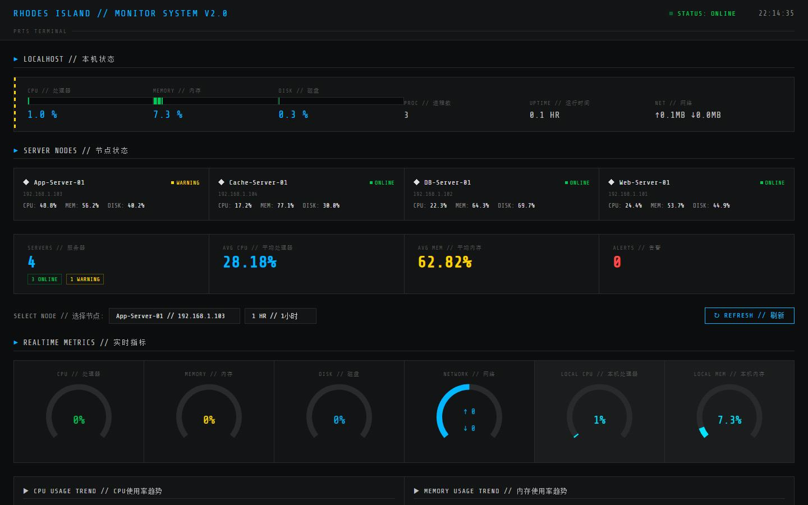
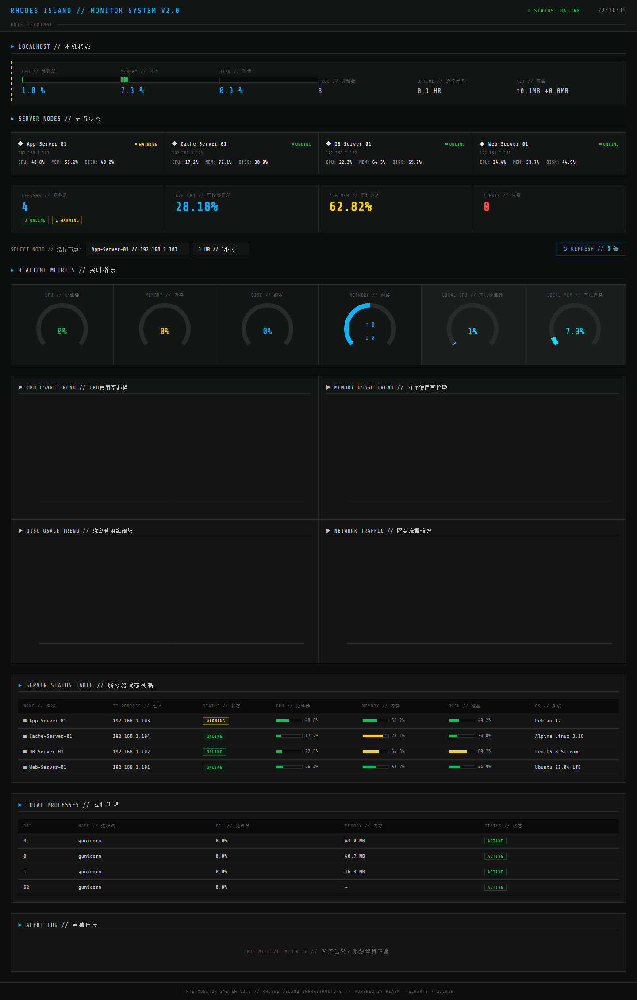

# Cloud Monitor Dashboard

基于 Python Flask + MySQL + ECharts + Docker 构建的**云服务器监控仪表盘**系统，鹰角网络（明日方舟 PRTS）科技风格 UI。


## 界面预览




## 功能特性

- **实时监控仪表盘** — CPU、内存、磁盘、网络流量实时可视化展示
- **多服务器管理** — 支持同时监控多台服务器的运行状态
- **历史趋势分析** — 可查看 30 分钟到 24 小时的历史数据趋势
- **告警系统** — 内置阈值告警规则，支持告警记录与解决标记
- **RESTful API** — 完整的后端 API 接口，支持二次开发
- **Docker 容器化** — 一键 Docker Compose 部署，开箱即用
- **暗色主题 UI** — 专业监控风格界面，支持响应式布局

## 技术栈

| 层级 | 技术 |
|------|------|
| 后端框架 | Flask 3.0 + Flask-CORS |
| 数据库 | MySQL 8.0 + PyMySQL |
| 系统采集 | psutil |
| 前端图表 | ECharts 5.5 |
| 容器化 | Docker + Docker Compose |
| 生产部署 | Gunicorn |

## 项目结构

```
cloud-monitor-dashboard/
├── app/
│   ├── __init__.py          # Flask 应用工厂
│   ├── config.py            # 配置管理
│   ├── db.py                # 数据库连接管理
│   ├── collector.py         # 系统指标采集模块
│   ├── routes.py            # RESTful API 路由
│   ├── page_routes.py       # 页面路由
│   ├── templates/           # Jinja2 模板
│   │   ├── dashboard.html   # 主仪表盘页面
│   │   └── servers.html     # 服务器管理页面
│   └── static/              # 静态资源
│       ├── css/
│       │   └── dashboard.css
│       └── js/
│           └── dashboard.js
├── scripts/
│   ├── init_db.py           # 数据库初始化脚本
│   ├── init_db.sql          # SQL 初始化脚本 (Docker)
│   ├── generate_data.py     # 模拟数据生成器
│   └── seed_data.py         # 数据填充脚本
├── .env.example             # 环境变量示例
├── .dockerignore
├── .gitignore
├── docker-compose.yml       # Docker Compose 编排
├── Dockerfile               # Docker 镜像构建
├── requirements.txt         # Python 依赖
├── run.py                   # 应用入口
└── README.md
```

## 快速开始

### 方式一：Docker Compose 一键部署（推荐）

```bash
# 克隆项目
git clone https://github.com/your-username/cloud-monitor-dashboard.git
cd cloud-monitor-dashboard

# 启动所有服务
docker-compose up -d

# 等待 MySQL 初始化完成后，填充模拟数据
docker-compose exec web python /seed-scripts/seed_data.py

# 访问仪表盘
# http://localhost:5000
```

### 方式二：本地开发运行

**前置要求：**
- Python 3.11+
- MySQL 8.0

```bash
# 1. 克隆项目
git clone https://github.com/your-username/cloud-monitor-dashboard.git
cd cloud-monitor-dashboard

# 2. 创建虚拟环境
python -m venv venv
source venv/bin/activate  # Linux/Mac
# venv\Scripts\activate   # Windows

# 3. 安装依赖
pip install -r requirements.txt

# 4. 配置环境变量
cp .env.example .env
# 编辑 .env，填入你的 MySQL 连接信息

# 5. 初始化数据库
python scripts/init_db.py

# 6. 生成模拟数据
python scripts/generate_data.py

# 7. 启动应用
python run.py
# 访问 http://localhost:5000
```

## API 接口文档

| 方法 | 路径 | 说明 |
|------|------|------|
| GET | `/api/overview` | 系统总体概览 |
| GET | `/api/servers` | 获取所有服务器列表及最新指标 |
| GET | `/api/servers/<id>` | 获取单台服务器详情 |
| GET | `/api/metrics/<id>` | 获取服务器监控指标（支持 `?minutes=60`） |
| GET | `/api/metrics/<id>/latest` | 获取最新一条指标 |
| GET | `/api/metrics/<id>/summary` | 获取指标统计摘要 |
| GET | `/api/alerts` | 获取告警列表（支持 `?resolved=0&limit=20`） |
| POST | `/api/alerts` | 手动创建告警 |
| PUT | `/api/alerts/<id>/resolve` | 标记告警已解决 |
| GET | `/api/health` | 健康检查 |
| GET | `/api/local/status` | 获取本机（运行 Flask 的机器）系统信息 |
| GET | `/api/local/metrics` | 获取本机实时监控指标（CPU、内存、磁盘、网络等） |
| GET | `/api/local/processes` | 获取本机占用资源最多的 Top 10 进程 |

**响应格式示例：**

```json
{
    "code": 200,
    "data": { ... }
}
```

## 数据库设计

- `servers` — 服务器信息表（名称、IP、状态、硬件配置）
- `metrics` — 监控指标记录表（CPU、内存、磁盘、网络、进程数）
- `alert_rules` — 告警规则表（阈值配置）
- `alerts` — 告警记录表（告警历史与解决状态）

## 扩展方向

- [ ] 接入真实服务器 SSH 采集（paramiko）
- [ ] WebSocket 实时推送
- [ ] 邮件/钉钉告警通知
- [ ] Kubernetes Pod 监控集成
- [ ] Prometheus + Grafana 数据对接
- [ ] 用户认证与权限管理

## License

[MIT](./LICENSE)
